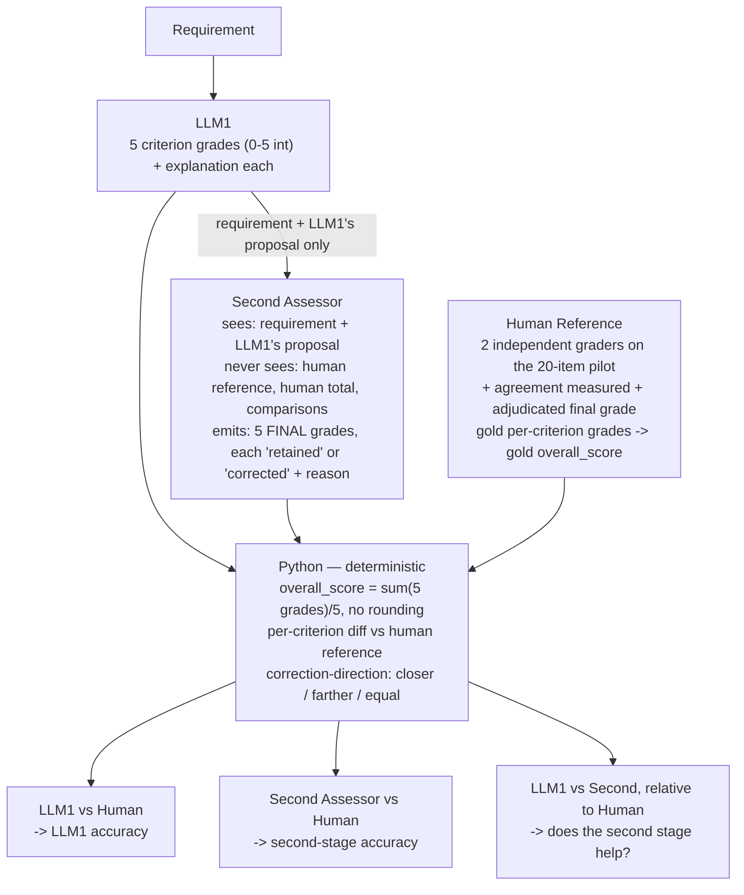

# Implementation Plan — Project 1: The Grader (v2)

Status: **planning only, no implementation code has been changed.** This
supersedes the first version of this plan. It resolves the open questions
raised there (criterion set, scale, what the second model emits) and corrects
one assumption I had made — the second model does **not** see human
references. This version also reframes what's actually being measured: two
independent graders assessing the **original requirement**, not a judge
grading LLM1's answer quality.

## 1. The objective, precisely

> The system assesses the quality of the original software requirement.

```
Requirement
  → LLM1: five grades + explanations
  → Second assessor: verify or correct those grades
  → Python: calculate totals and compare both stages with human references
```

**This is not an answer-quality judge.** LLM1 and the second assessor are two
independent gradings of the *requirement itself*; the second assessor's input
includes LLM1's proposal (which it may challenge), but never human data. The
project measures agreement between these two assessments and human ground
truth — it does **not** validate a judge that scores "how good was LLM1's
critique." That distinction is carried through the rest of this plan.

## 2. Scoring contract

- Five canonical criteria, fixed spelling: `atomicity`, `testability`,
  `feasibility`, `clarity`, `completeness`.
- Each graded as an **integer 0–5**. Higher = better quality.
- `overall_score = sum(five criterion grades) / 5` — computed in Python,
  never invented by a model. Keep the decimal unrounded until comparison.
- The second assessor grades the **original requirement**, using LLM1's
  grades/explanations as a challengeable proposal. It receives **no human
  labels, no human total, no computed comparison results** — it must be able
  to be wrong independently of LLM1, or "agreement with humans" is
  meaningless.
- Removed from the active workflow: the `improved_requirement` rewrite, and
  the old 1–5 answer-quality rubric. Historical prompts/results stay on disk,
  just unused.

## 3. Flow diagram



## 4. Establishing trustworthy human references (data work — do this first)

Update the guide **before** touching any model prompts.

**Grade anchors** (common across all five criteria, each criterion also gets
its own worked definition/examples at each anchor):

| Grade | Meaning |
|---|---|
| 5 | Fully satisfies the criterion within the stated scope |
| 4 | Minor defect, limited impact |
| 3 | Partially satisfies it; a material defect remains |
| 2 | Major defect substantially undermines the criterion |
| 1 | Very little of the criterion is satisfied |
| 0 | Fundamentally fails the criterion |

**Preserve the existing boundary rules** already in the guide/prompts — they
don't change, only the scale wrapping them does:
- Conditions, triggers, and fields attached to one obligation don't
  automatically make a requirement non-atomic.
- An objectively verifiable requirement doesn't need a specified test
  procedure to be testable.
- Completeness is judged only within the requirement's stated scope, not
  the whole system.
- Difficulty or expense alone doesn't establish infeasibility.

**Re-labelling process:**
1. Two humans independently grade the **existing 20 requirements** (not a
   new/expanded set yet) on the 0–5 scale per criterion, with a brief
   justification each.
2. Preserve both humans' original annotations as-is (don't overwrite).
3. Measure inter-labeller agreement (exact-match %, agreement-within-1 %,
   per criterion).
4. Adjudicate disagreements to a single agreed reference grade per criterion
   per item; `gold_score = sum(agreed grades) / 5`.
5. **Do not** reinterpret the old 0/1 `violations` values as 0–5 grades, and
   do not auto-generate replacement "human" scores — this has to be real
   re-labelling.
6. Version-mark the new convention explicitly (e.g. a `scheme` field) so the
   old binary-labelled rows and the new 0–5 rows can never be silently mixed
   by a loader.
7. Use this 20-item pass to shake out rubric ambiguities *before* scaling to
   150+ items.

## 5. Pipeline migration (code work)

**v4 prompts + structured outputs:**
- **LLM1**: five criterion grades (0–5 int) + a concise explanation each.
  Nothing else — no total, no rewrite.
- **Second assessor**: five *final* grades, each explicitly marked as
  retaining or correcting LLM1's proposed grade, with a reason. It must
  actually check the requirement itself — it's allowed to retain every
  grade when LLM1's proposal holds up, it isn't forced to find fault.
- **Python scorer**: both overall scores, per-criterion diffs from the human
  reference (once available), overall-score diffs.

Both models receive the same applicable criterion guide (rubric + anchors +
boundaries). Neither receives human reference data in its request.

**Runner adaptation** — keep everything that already works well:
- Immediate terminal progress per stage (as today).
- Unique, never-overwritten result files per run.
- Dev-set-only selection (test stays held out).
- Explicit per-item failure records, not silent drops.

**Each saved result row contains:** requirement, reference (gold) grades,
LLM1's output, the second assessor's output, both computed overall scores,
comparison results, prompt/model versions, per-call timing, and execution
status. **Reference grades go in the saved record, never in a model
request** — this needs an explicit test (see §7).

**Interim validation:** until the re-labelled 20-item set is ready, validate
the implementation against clearly-named **synthetic** test fixtures. Do not
report model–human agreement numbers from synthetic data — that's a
correctness check on the code, not a quality measurement.

## 6. Measuring whether the second stage actually helps

Run the revised 20-item pilot first, with model/temperature/etc. fixed.
Report **separately** for LLM1 and the second assessor:

- Exact per-criterion agreement with the human reference — counts and %.
- Agreement within one grade (±1) — counts and %.
- Mean absolute error per criterion.
- Overall-score absolute error, and exact overall-score agreement.
- Items where all five grades match exactly.
- Successful vs. failed item counts.

**Then measure the correction directly**, not just infer it: for every
criterion decision, classify whether the second assessor's final grade moved
**closer to**, **farther from**, or **equally distant from** the human
reference compared to LLM1's original grade. This is what actually answers
"does the second stage help" — don't assume it from the overall-score
numbers alone, since per-criterion errors can cancel out and make two very
different assessments look identical at the total level.

**Sequencing:** only after the rubric and this 20-item pilot are stable do
we expand to the double-labelled 150+ set and carve out a held-out test
split. Tuning happens on dev data only; test is for final reporting.

**Bias experiments (deferred until the above is stable), fixed inputs:**
- **Verbosity bias**: pad LLM1's explanations with filler that changes
  neither the grades nor the substantive content; measure whether the
  second assessor's final grades shift anyway.
- **Position bias**: a **separate paired-assessment diagnostic**, not part
  of the normal single-item scoring flow — present two candidates, swap
  which one appears first, and check whether the preferred *physical
  position* changes the verdict.

## 7. Validation, deliverables, interpretation

**Automated tests must cover:**
- Complete criterion coverage (all five present, no extras).
- Strict integer grades in 0–5 (reject floats, out-of-range, bools-as-int).
- Correct averaging (`overall_score` computed right, unrounded).
- Reference grades never appear in an outgoing model request payload.
- Mismatched dataset versions are rejected, not silently coerced.
- Identical overall scores produced from different per-criterion grades are
  still distinguished downstream (comparison logic must use per-criterion
  diffs, not just the total).
- Failed model calls produce an explicit error record, not a silent gap.

**Rollout:** a few live items first, then the full 20-item pilot. Preserve
every run's results; link every prompt revision to its measured effect in
the changelog.

**Final report sections:** human–human agreement, model–human
requirement-grading agreement (both stages, separately), the measured effect
of the second assessor (correction-direction results), bias results,
cost/latency, limitations.

**Interpretation to document explicitly, verbatim in spirit:** this design
measures agreement on *requirement quality*. It does **not** independently
validate a judge that grades the quality of *LLM1's answers*. Two assessors
grading the same artifact and being checked against humans is a different
(and here, correct) claim than "an LLM judge verified to grade responses
reliably" — don't let the report overstate which one was built.

## 8. What already exists vs. what's missing (updated against this contract)

| Component | Exists today | Gap |
|---|---|---|
| Criterion set | `atomicity, testability, feasibility, clarity, completeness` already in guide/dataset | None — this matches. |
| Scale | Binary 0/1 in `golden_set.jsonl`, binary pass/fail in the guide | Needs full re-labelling to 0–5 per §4; not a mechanical conversion. |
| Guide boundary rules | Present (atomicity/testability/completeness/feasibility boundaries) | Preserve as-is; only wrap with the new 0–5 anchor table. |
| LLM1 (`reviewer.py`, `critique_prompt_v3.txt`) | Emits sparse violations + a rewrite | Replace with 5 required 0–5 grades + explanations; drop rewrite entirely. |
| Second assessor (`judge.py`, `judge_prompt_v3.txt`) | Grades critique quality 1–5 blind, guide-dependent load is currently broken | Full redesign: grades the requirement itself, sees LLM1's proposal, blind to human data, emits 5 retain/correct grades + reasons. |
| Python aggregation | Does not exist (`scorer.py` does binary set comparison only) | New: `overall_score = sum/5`, per-criterion diffs, correction-direction classifier. |
| Leakage prevention | No explicit test today | New test: assert gold fields never serialize into a model request. |
| Dataset versioning | Single schema, no version marker | Add explicit scheme/version field; loader rejects mixed versions. |
| Bias checks | 0% built | New, deferred until pilot is stable (§6). |
| Test fixtures | Existing tests use mocked real-shaped data | Needs synthetic fixtures explicitly labeled as such until real re-labelled data exists. |

## 9. Order of implementation

1. Guide: add 0–5 anchors per criterion (§4), keep boundary rules.
2. Re-label the 20-item pilot (two humans), measure agreement, adjudicate,
   version the new dataset file.
3. `schemas.py`: LLM1 output (5× `{grade: int 0-5, explanation: str}`),
   second-assessor output (5× `{grade: int 0-5, retained: bool, reason:
   str}`), strict validation.
4. Python aggregation module: `overall_score`, per-criterion diff,
   correction-direction classifier.
5. `reviewer.py` + `critique_prompt_v4.txt`.
6. `judge.py` → second-assessor module + `judge_prompt_v4.txt` (sees
   requirement + LLM1 proposal only).
7. `runner.py`: rewire to new schemas, add latency logging, leakage-safe
   request construction, dataset version check.
8. Tests: synthetic fixtures covering §7's required cases.
9. Run the 20-item pilot, produce the §6 report.
10. Only then: scale to 150+, double-label, dev/test split, bias
    experiments, cost model.

## 10. Remaining minor open items

- **Cost model basis** — not addressed in this spec. Still proposing a
  compute-time proxy (local Ollama has no $ cost) plus an optional
  hosted-model $/1k extrapolation, pending confirmation.
- **Dataset version field name/format** — not prescribed; will propose a
  concrete shape (e.g. `scheme: "grade_0_5_v1"`) when `schemas.py` is written.

---

No code has been modified. This plan is ready for implementation starting at
§9 step 1 once you confirm.
