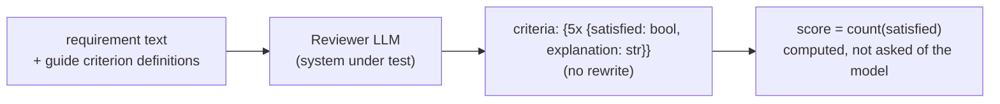
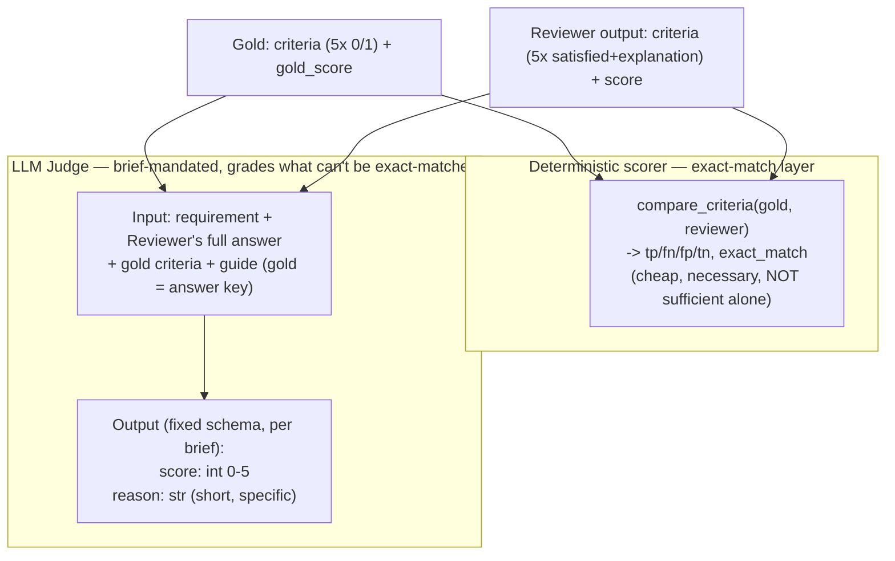
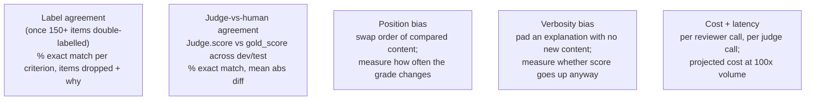

# Evaluation Pipeline — Target Design (v2, grounded in the Project 1 brief)

This supersedes the previous version. Two corrections drove this revision:

1. **The brief (`grader.pdf`) was not consulted before the first draft.** This is
   CS496 Project 1 ("The Grader") — the harness itself is the graded deliverable,
   the task-system is only there to be measured, and the brief specifies the
   Judge's schema, the required bias checks, and the reliability report in
   detail. Those requirements weren't reflected in v1.
2. **LLM1 (Reviewer) no longer proposes a rewrite.** Its job is reduced to
   identifying and explaining criterion violations; `improved_requirement` is
   removed entirely.

## 1. What the brief actually requires

| Deliverable | Brief's words | Status in this repo |
|---|---|---|
| Golden set, 150+ items, double-labelled | "Two people label every item. Measure how often they agree and report it." | 20 items, single-labelled pilot. Scaling + agreement measurement is open work. |
| Labelling guide | "what 'good' means, with examples" | Done (`data/labelling_guide.md`). |
| Harness | "Runs any system on the whole set with one command. Writes one row per item: input, output, score, reason." | Exists (`harness/runner.py`), needs rewiring to the new schemas below. |
| Structured output | "a fixed JSON schema so scoring never depends on text parsing" | Done via Pydantic + Ollama `format=`. |
| LLM judge | "reads the input and the answer, gives a grade using your labelling guide... returns a grade **and a short reason** in a fixed schema" | Exists but schema/role need correcting (see §3). |
| Reliability report | Agreement w/ humans, **position bias**, **verbosity bias**, cost + latency per judged item | **Missing entirely.** Biggest gap. |
| Prompts + changelog | versioned, changes linked to score deltas | Partially done (`prompts/CHANGELOG.md`), needs a v4 entry. |
| Cost model | "today and at 100×" | **Missing entirely.** |
| report.pdf (max 4 pages), postmortem.md | 6 fixed sections; postmortem must report real problems | Both present but empty — not a code task, flagged for later. |

Grading weight is **Measured 40%, Works 25%, Documented 25%** — the reliability
report and bias checks are worth more than the harness simply running. They
should be the next priority after the schema/prompt fixes, not an afterthought.

## 2. LLM1 (Reviewer) — system under test, score only

Dropped: `improved_requirement`. The Reviewer's only job now is: for each of
the five criteria, say whether it's satisfied and explain why. The
explanations are the part that can't be exact-matched — that's what makes this
a legitimate "no single correct answer" task per the brief's five-question
test, and what the LLM Judge exists to grade.

## 3. Two separate correctness checks — not one

The brief warns: *"If exact match works, the task is too easy."* So the
boolean verdicts alone (which **can** be exact-matched) are not the whole
story — they're a cheap mechanical layer. The LLM Judge's job is the part that
can't be mechanically checked: whether the explanations are actually sound.

**JudgeOutput is deliberately simple** — `{score, reason}`, nothing more. The
brief says "a grade and a short reason in a fixed schema"; a per-criterion
sub-schema (what the previous design proposed) over-engineers past that and
risks structured-output failures on a small local model. The Judge reasons
internally about all five criteria using the guide and the gold answer, but
only commits one number and one sentence.

## 4. Reliability report — the part that's entirely missing

- **Position bias** needs a small dedicated experiment, not just the main
  per-item loop: construct paired prompts presenting the same content with
  element order swapped (e.g., which of two candidate answers is listed
  first when asking the Judge to compare), run both orders, diff the grade.
- **Verbosity bias**: take a real Reviewer explanation, pad it with filler
  that adds no information, re-run the Judge, check whether the score rises.
- **Cost + latency**: not currently logged anywhere in `runner.py`. Needs
  wall-clock timing per model call recorded on each result row, plus an
  aggregate cost model (compute-time basis for local Ollama, or $/1k-request
  if extrapolated to a hosted model) at current and 100× volume.

This is new code, not a rewiring of existing code — `harness/` currently has
no bias-testing or cost-tracking module at all.

## 5. Revised file-level plan

- **`schemas.py`** — `RequirementCritique`: `criteria` dict only, no
  `improved_requirement`. `JudgeOutput`: back to `{score: int 0-5, reason:
  str}` — simple, matches the brief, no cross-validator against a criteria
  sub-schema since the Judge no longer emits one.
- **`reviewer.py` + `critique_prompt_v4.txt`** — drop every rewrite
  instruction; ask only for the five criteria verdicts + explanations.
- **`scorer.py`** — keep `compare_criteria` (Reviewer vs gold) as today's
  logic; add `compare_score(gold_score, judge.score)` for the Judge-vs-human
  agreement metric in the reliability report.
- **`judge.py` + `judge_prompt_v4.txt`** — Judge sees requirement +
  Reviewer's full answer + gold criteria/guide; emits `{score, reason}` only.
- **New: a bias-check module** — position bias + verbosity bias experiments,
  separate entry point from the main per-item pipeline, producing its own
  report output.
- **`runner.py`** — add per-call latency to each row; wire the simplified
  schemas; filename bump.
- **Not code yet, but required before submission**: scale the golden set to
  150+, double-label it, measure and report inter-labeller agreement; fill in
  `report.pdf` (6 sections, 4 pages) and `postmortem.md`; build the cost model.
